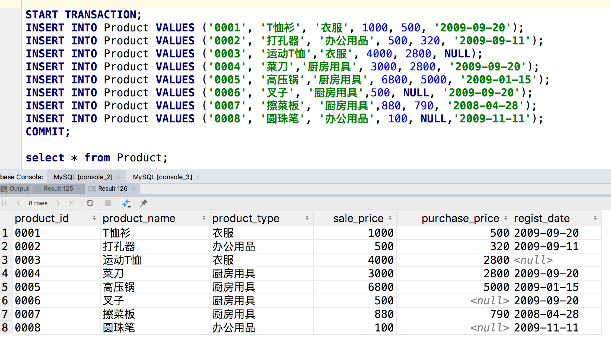

这个是《sql基础教程》里面的示例

```sql
DROP table if exists Product;
CREATE TABLE if not exists Product (
  product_id CHAR(4) NOT NULL,
  product_name VARCHAR(100) NOT NULL,
  product_type VARCHAR(32) NOT NULL,
  sale_price INTEGER,
  purchase_price integer,
  regist_date DATE,
  PRIMARY KEY (product_id));

START TRANSACTION;
INSERT INTO Product VALUES ('0001', 'T恤衫', '衣服', 1000, 500, '2009-09-20');
INSERT INTO Product VALUES ('0002', '打孔器', '办公用品', 500, 320, '2009-09-11');
INSERT INTO Product VALUES ('0003', '运动T恤','衣服', 4000, 2800, NULL);
INSERT INTO Product VALUES ('0004', '菜刀','厨房用具', 3000, 2800, '2009-09-20');
INSERT INTO Product VALUES ('0005', '高压锅','厨房用具', 6800, 5000, '2009-01-15');
INSERT INTO Product VALUES ('0006', '叉子', '厨房用具',500, NULL, '2009-09-20');
INSERT INTO Product VALUES ('0007', '擦菜板', '厨房用具',880, 790, '2008-04-28');
INSERT INTO Product VALUES ('0008', '圆珠笔', '办公用品', 100, NULL,'2009-11-11');
COMMIT;
```



这张表记录了一些商品信息。

