# 'INNER JOIN' 和 'OUTER JOIN' 之间有什么区别？ 38549

# 答

首先假设我们有下面两张表：

```sql
drop table if exists t_a;
create table t_a(id int);
insert into t_a(id) values (1);
insert into t_a(id) values (2);
insert into t_a(id) values (3);
insert into t_a(id) values (4);

drop table if exists t_b;
create table t_b(id int, str char(10));
insert into t_b(id) values (3);
insert into t_b(id, str) values (4, 'qq');
insert into t_b(id, str) values (4, 'mm');
insert into t_b(id) values (5);
insert into t_b(id) values (6);
```


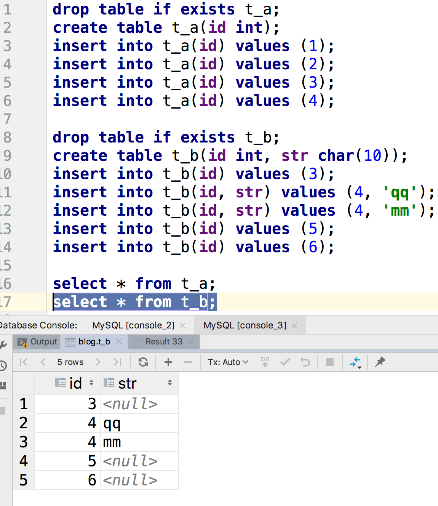

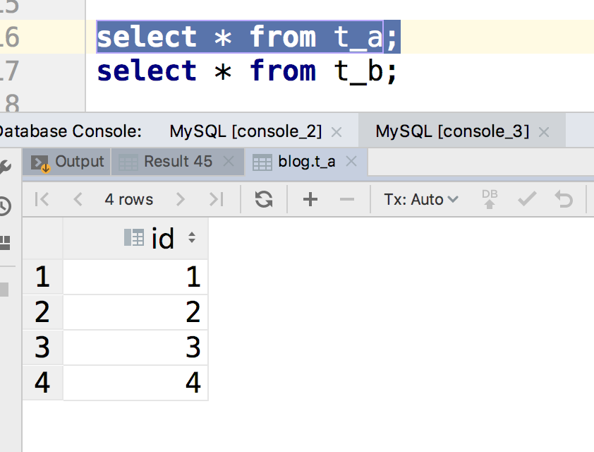

## Join


回答这个问题之前，首先要明白join这个关键字

那么👇这个语句的返回值是什么？

```sql
select * from t_a join t_b;
```

读者可以思考下再来看结果。


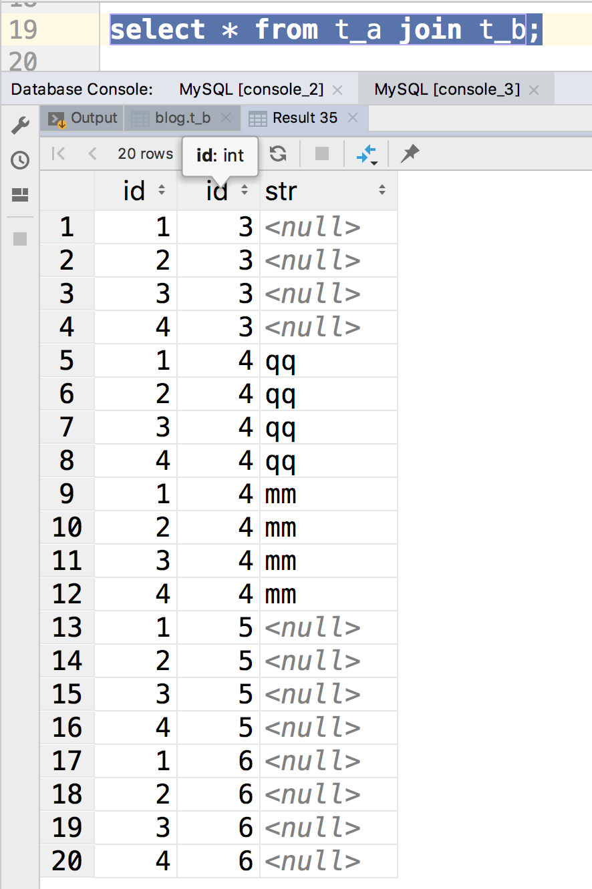

上面的就是 join的结果。

我们来分析下上面的结果。刚好是 4 * 5 = 20 行。

这其实是把两个表给 【相乘】 了(PS：我数学知识都还给语文老师了，这种表达可能有误)。

类似于笛卡尔积吧。

上面的语句还有一种写法，就是 `cross join`

``` sql
select * from t_a cross join t_b;
```

结果是一样的。


### inner join

```sql
select *
  from t_a inner join t_b
       on t_a.id = t_b.id;
```

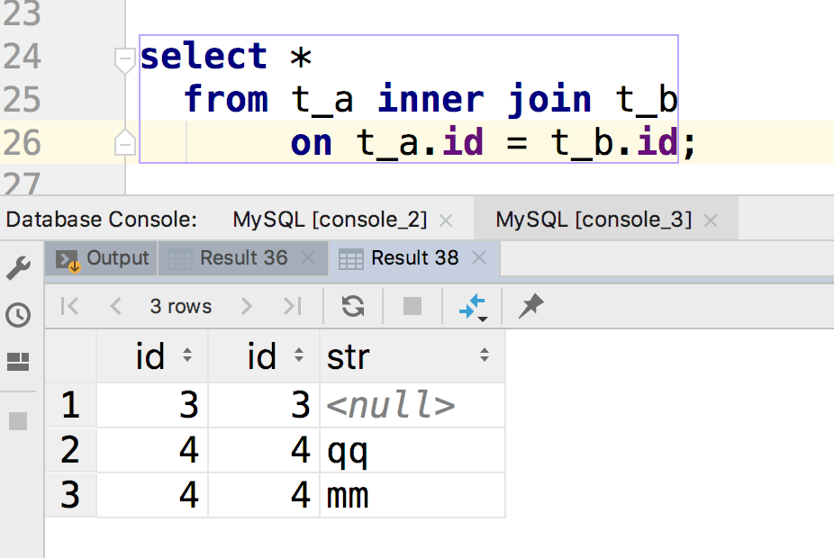

`inner join` 就是对`join`的结果进行过滤，它只保留符合`on`后面条件的结果。

这里我们只筛选出两个表中id相同的结果。

上面的SQL语句等价于👇的

```sql
select * from t_a, t_b
 where t_a.id = t_b.id;
```

这个语句其实隐式的产生了inner join操作。

不过前者更有语义化，推荐是使用前者，不要使用后者。

### outer join

在之前的inner join过程中，我们发现这样的记录也被过滤了

比如说在`t_b`表中有的`id`为`5`的记录，它在`t_a`表中就没有对应的`id`为`5`的记录，导致这样的数据直接被过滤了。

如果你想保留这些数据，你可以使用 `outer join`

```sql
select *
  from t_a right outer join t_b
       on t_a.id = t_b.id;
```

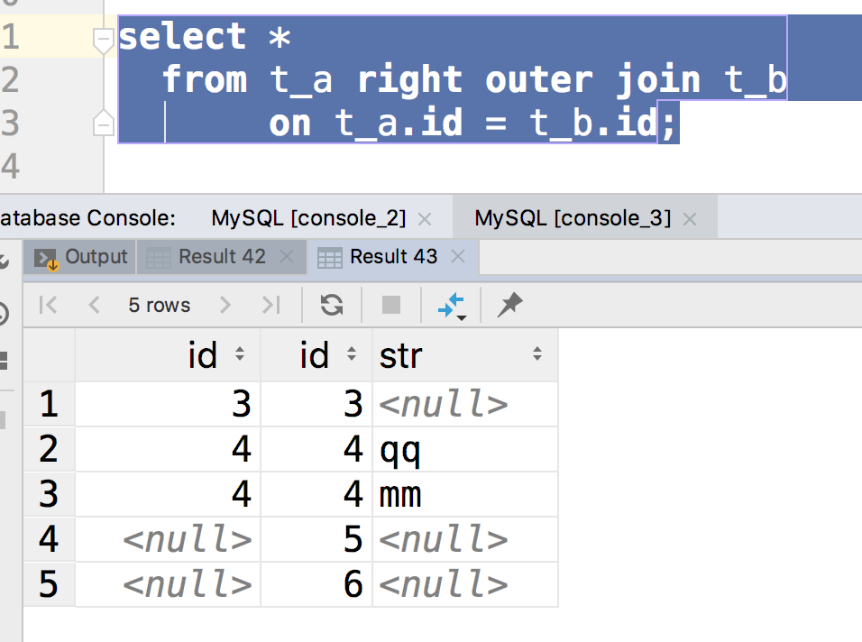

我们可以看到outer join相比于inner join就是会保留一些没有匹配上的数据。然后`outer join` 分为 `left outer join` 和`right inner join`。它们的区别在于一个是以左边的为基准，一个是以右边的为基准，看下操作结果就明白了。

```sql
select *
  from t_a left outer join t_b
       on t_a.id = t_b.id;
```


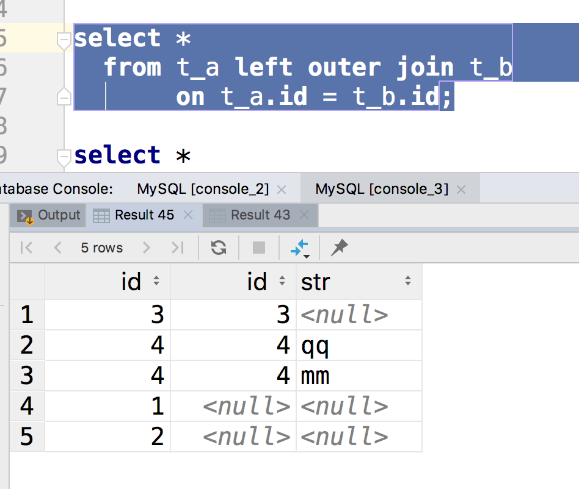


其实用语言不好描述，大家多看几次结果就懂了。

#### full outer join

当然，除了有左联结，有联结，含有全联结

参考这样的语句

```sql
select *
  from t_a full outer join t_b
       on t_a.id = t_b.id;
```

不过我用的是MySQL，目前不支持这种写法，但是上面的语句可以通过下面的写法来模拟

```sql
select *
  from t_a right outer join t_b
       on t_a.id = t_b.id
union 
select *
  from t_a left outer join t_b
       on t_a.id = t_b.id;
```

## 总结

- `inner join` 就是取两个表的交集

  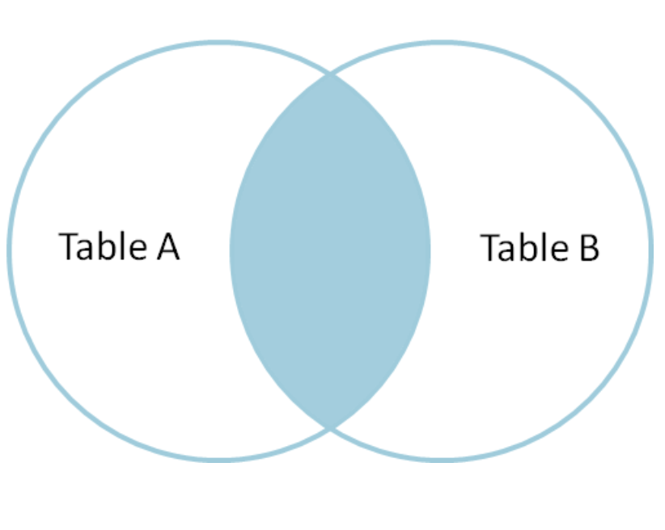

- `left outer join`

  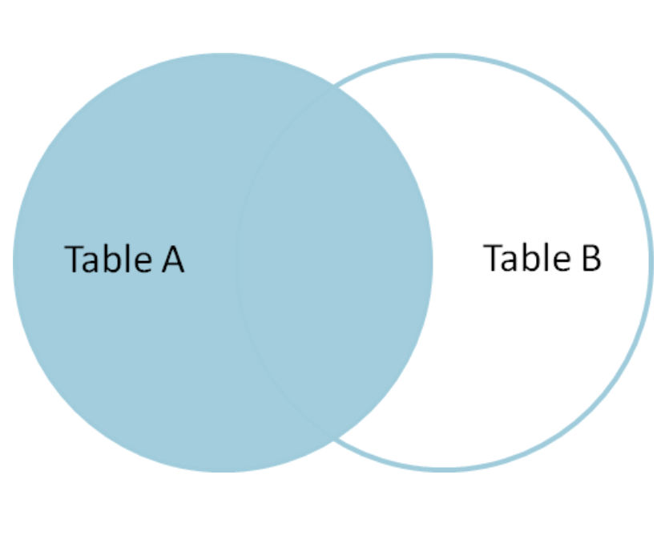

- `full outer join`的结果如下

  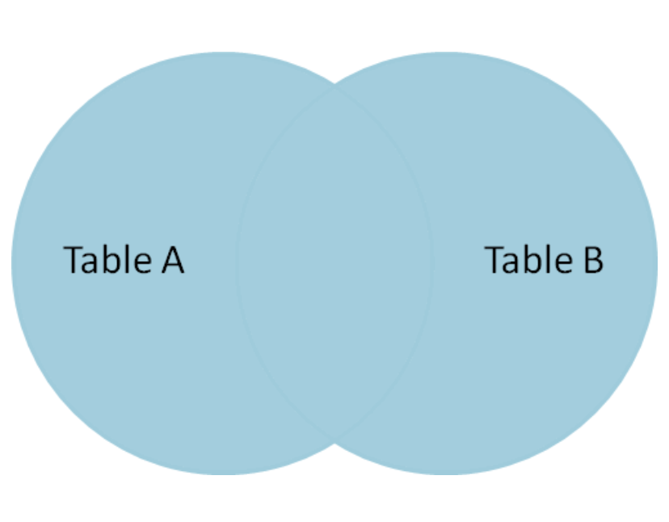


## 发散思维

如果我想要下面的结果， 如何写SQL语句？

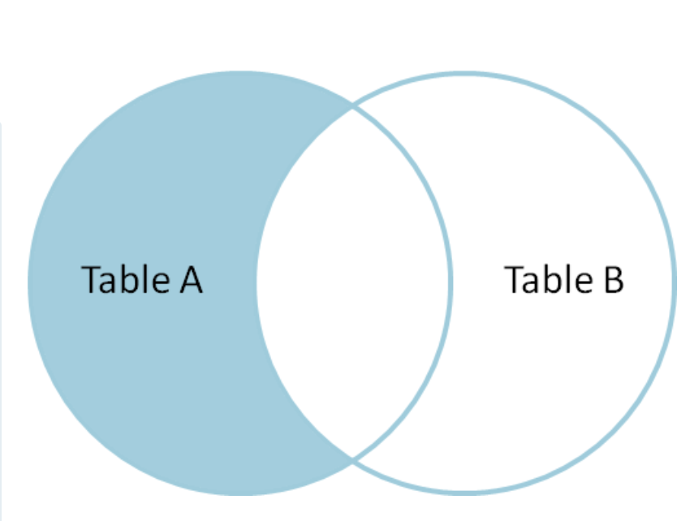


### 下拉可以看到答案

。

。

。

。

。

。

。

。

。

。

。

```sql
select *
  from t_a left outer join t_b
       on t_a.id = t_b.id
where t_b.id is null;
```

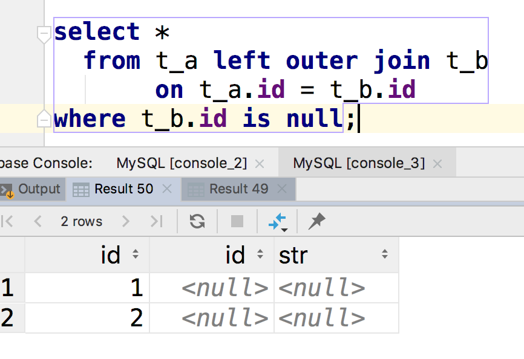

上述SQL语句删除了在集合a但是不在集合b的记录。